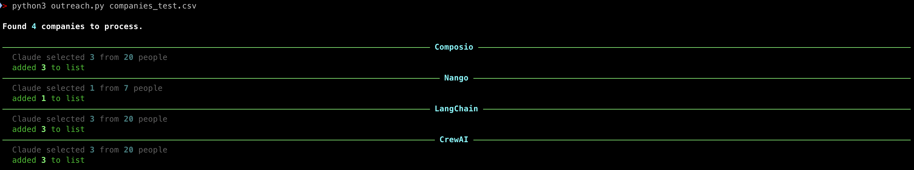
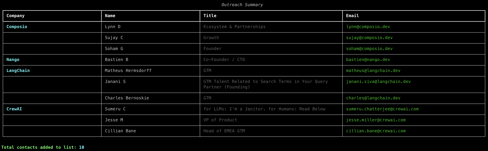

# Apollo Outreach Bot

Outreach bot, Feed it a CSV of companies, and it finds the right people to contact at each one, adds them to an Apollo list, and adds the company to a separate accounts list — ready for a sequence.

## How it works

1. **Read companies** from a CSV (`company_name`, `website`)
2. **Fetch 20 people** per company from Apollo with no title filter
3. **Claude picks the best 3** — using reasoning to identify your needs
4. **Reveal emails** via Apollo's enrichment API (1 credit per person)
5. **Add contacts** to your Apollo contacts list
6. **Add the company** to your Apollo accounts list

## Claude's role

Rather than relying on keyword filters (which either miss people at small startups or pull in CMOs and CEOs at large ones), the bot hands Claude a roster of 20 people and asks it to reason about who is the right fit.

The candidate pool and selection count are configurable:

```python
APOLLO_FETCH_COUNT   = 20  # people fetched from Apollo per company
CONTACTS_PER_COMPANY = 3   # how many Claude picks
```

## Example output

**Terminal — processing log:**



**Summary table:**



## Setup

```bash
pip install -r requirements.txt
```

Create a `.env` file:

```
APOLLO_API_KEY=your_apollo_api_key
APOLLO_LIST_NAME=Your Contacts List Name
APOLLO_COMPANIES_LIST_NAME=Your Companies List Name
ANTHROPIC_API_KEY=your_anthropic_api_key
```

- **Apollo API key** — Settings → Integrations → API in Apollo
- **List names** — must match exactly what's in Apollo (case-sensitive)
- **Anthropic API key** — console.anthropic.com

## CSV format

```csv
Company,Website
Stripe,stripe.com
Notion,notion.so
LangChain,langchain.com
```

## Run

```bash
# Full list
python outreach.py

# Test subset
python outreach.py companies_test.csv
```

## Cost

- **Apollo credits** — 1 credit per email revealed (only for people with emails in Apollo's database)
- **Claude** — ~$0.001 per company (Haiku model, simple classification task). Under $0.03 for a 28-company list.
